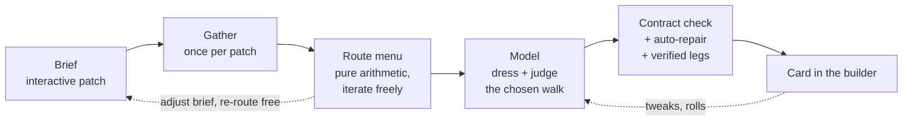

# Route planning: the product design

*The caddy is the paid feature, and a paid feature earns its price by being
right. This document designs the next version of route planning — the UI that
narrows the area, the arithmetic that finds the walks, and the model's place
in between — against one goal: **a card the host keeps, 99 times in 100.***

---

## 1. The thesis

The pipeline already embodies the right idea: **everything a function can
decide, a function decides.** The model never invents a pub (ids are an enum),
never orders the walk (`orderWalk`/`forwardOrder` do), and never searches the
map (`buildRouteGraph` hands it complete routes). What remains for the model
is choosing between routes and dressing them — the two things only judgement
can do.

Three structural facts fall out of the current code, and the whole design
rides on them:

1. **The route engine is pure and instant.** `buildRouteGraph` is pure
   TypeScript — no clock, no network, no key. It runs in milliseconds at
   N≈40. Nothing stops it running *in the browser*, live, under a thumb.
2. **A go is only spent when a card arrives.** A `caddy_turns` row exists only
   where a card landed. Everything before the model call — gather, routing,
   iteration — is free to the host's allowance by construction.
3. **The failures live at the seams, not in the modules.** The bug history
   says so plainly: `aimFrom` declared but never constructed; `reachKm: 1.2`
   (a ring radius) fed to `targetKmFor` as a distance; two candidates both
   named `p3`. Each module was proven; the handoff was not.

So the design is: **put the host's confirmation before the spend, put the
iteration where it costs nothing, and put verification after the model** —
and measure every stage, because 99% is a number and numbers get measured.

Deterministic → stochastic → deterministic. The model is bracketed by
arithmetic, and the arithmetic is bracketed by tests.

---

## 2. What "perfect" means — making 99% measurable

"Perfect 99% of the time" is unfalsifiable until *perfect* is a predicate.
Define the **Card Contract**: the machine-checkable properties of a card that
was worth paying for. A card is *clean* when every clause holds.

| # | Clause | Checked by | Today |
|---|--------|-----------|-------|
| C1 | Every hole is a real venue from the dossier, used once | `parsePlan` (enum ids, dedupe) | ✅ enforced |
| C2 | Pinned tees sit at the ends | `parsePlan` pin assertion | ✅ enforced |
| C3 | The walk never doubles back | `forwardOrder` (monotone by construction) | ✅ enforced |
| C4 | Full hole count — never a quietly shorter round | `parsePlan` (`short`) | ✅ enforced |
| C5 | Hazards legal: none on hole 1, no water last | `parsePlan` strips; prompt asks | ⚠️ last-hole only |
| C6 | Legs within tolerance of the asked spacing; no brutal leg | scoring penalty only | ❌ not asserted |
| C7 | Every pub **open at its estimated arrival time** | — | ❌ not gathered |
| C8 | Every drink pourable where it's written (`servesBeer` etc.) | `drinkForHazard` partially | ⚠️ hazards only |
| C9 | Walk minutes on the card reflect **streets, not crow-flies** | — | ❌ haversine |
| C10 | Named, and named for *this* round | fallback naming | ⚠️ fallback exists |

The contract becomes a pure module (`lib/caddy/contract.ts`): card in,
violations out. It runs **after every plan and every tweak**, its score is
logged per turn (a column on `caddy_turns`, additive migration), and the
funnel gains the number the business actually cares about:

> **clean-card rate** = cards with zero violations *and* zero repairs,
> ÷ cards delivered — alongside **keep rate** (host saved it without
> re-rolling), which is the human vote the contract can't take.

Everything else in this document is a lever on those two numbers. Nothing
below is worth building unless it moves one of them.

---

## 3. Narrowing the area — the interactive patch

### The problem, honestly stated

Today the host types "Camden" into a text field and taps a button, and the
first evidence of what the caddy understood arrives *after* the plan runs.
The ring on the preview is display-only. The thin-patch refusal
(`candidateFloor`) fires server-side, after the tap. Between the typing and
the card sit four silent resolutions — geocoding the name, choosing the
centre, fixing the radius at a constant 1,200m, gathering candidates — and
the host confirms none of them. **Most bad cards are bad patches**, and the
patch is decided in the dark.

### Design: the patch is confirmed before it is spent

The brief keeps its text-first shape — typing a neighbourhood name is the
right mobile primary input, and the form already works. What changes is that
the map under the form stops being a picture and becomes **the instrument
that closes the loop** on every silent resolution:

**3.1 — Echo the resolution.** When the debounced search resolves "Camden",
the map frames it *and names it*: a small chip on the preview — **"Camden
Town, London — 27 pubs in reach"**. Wrong Camden is now a thing the host sees
in two seconds, not a thing the card reveals in twenty. Tapping the chip
offers the other candidate resolutions (the Places text results already
carry enough to offer "Camden, Bath" beneath). The count comes with it — see
3.3.

**3.2 — The ring grows a handle.** The reach ring becomes draggable at its
edge: drag out for "anywhere round here is fine", in for "this street,
please". Bounded 400m–2,500m, snapped to 100m, default the current 1,200m.
`PATCH_RADIUS_M` stops being a constant and joins `CaddyBrief` as `patchKm`
(clamped in `readBrief` like everything else). The ring the host sized is the
circle the gather searches — the drawing and the request become the same
fact, which is the same rule `reachOf` already keeps for the warning
threshold.

**3.3 — Candidates appear before the fee.** The moment an area resolves, the
*lean* search (the builder's existing free-tier `PLACES_FIELD_MASK` — no
atmosphere fields, no reviews) drops faint pint pins inside the ring and puts
the count in the chip. This moves `candidateFloor` client-side and **turns
the thin-patch refusal into a pre-flight warning**: "Only 8 pubs in this
ring — 9 holes needs 12. Widen the ring or drop to 6." The host fixes the
patch *before* anything is spent, instead of reading an apology after.
Nothing rich is fetched or stored — the dossier and its retention rules are
untouched; this is the same class of call the free builder search already
makes on every keystroke.

**3.4 — Pins as first-class starts.** Two additions the map earns once it's
interactive:
- **"Start where I'm standing"** — one tap, browser geolocation, sets
  `aimFrom` directly. The single most common real brief is "we're here now".
- **Long-press to drop a tee** — resolves via the existing free search to the
  nearest venue (the `startVenueId` plumbing already exists and is already
  honoured end-to-end; it just has no UI reachable from the caddy brief).

**3.5 — The corridor, drawn as what it is.** For A→B rounds the gather
searches a **capsule** — overlapping 600m circles down the line — but the
host is shown a single ring today. Draw the capsule: the stadium outline
between the two resolved ends, both ends draggable. The host sees precisely
where the caddy will and won't look, and "why is there no pub from the bit in
the middle" stops being a support question. The existing pace note and amber
warning (`stretchWarning`, `paceForReach`) keep working unchanged — they
already read from the same resolved reach.

**3.6 — Tap to exclude.** A faint candidate pin, tapped, gains a strike:
"not this one" (someone's ex runs it; they were barred in 2019). Excluded ids
travel on the brief (a bounded list, venue ids only — same validation shape
as pins) and are dropped from the gather's result before the dossier is
built. The model never knows they existed, which is exactly the amount it
needs to know. `exclude_pubs` already exists as a *model* tool; this is the
host-side twin, one step earlier and free.

**3.7 — When the round happens.** One new row on the brief: **"When"** —
chips for *Tonight · Tomorrow · Pick a day*, plus a tee-off time (defaults:
today, 7pm). Two lines of UI; it unlocks the single biggest correctness
upgrade in this document (§5.2, opening hours). Optional and default-honest:
unset means "tonight, evening", which is what the product already implicitly
assumes.

### What deliberately doesn't change

- **Text stays primary.** The map confirms and adjusts; it never becomes a
  prerequisite. A host who types "Shoreditch", ignores the map entirely and
  taps *Plan* gets today's flow exactly.
- **No polygon drawing.** Freehand area tools are desktop GIS furniture; on
  a phone they produce sad blobs. Ring + capsule + pins cover every real
  brief expressible on a scorecard.
- **Google basemap only** — Places pins on a Google map is a terms
  requirement the builder already honours; the interactive patch inherits the
  same map ID, cream/Midnight slots, and `colorScheme` selection.
- **No browser key → no map**, list-only, same graceful absence the builder
  keeps today. The text field still works; the echo chip (3.1) still works —
  it's the free search route, not the map.

---

## 4. The route menu — iterate where it's cheap

### The problem

`buildRouteGraph` already computes up to ten genuinely different walks —
best-fit, kindest legs, best-rated, most variety, widest drinks range,
cheapest round, beer gardens, room for a table, match on — and hands them to
**the model**, which picks one. The host never sees the menu. The one
judgement the host is best-placed to make — *what shape of night is this?* —
is delegated to the model, paid for, and discovered after the fact. When the
shape is wrong, the fix is a re-roll: another go, another twenty seconds,
another spin of the same wheel.

The user's instinct here is exactly right: **this part is cheap — iterate a
lot, before the AI.**

### Design: the menu goes on screen

After *Plan the round*: fee check, gather (once per patch, as today) — and
then, instead of going straight to the model, the route menu comes back to
the browser and draws itself:

- **The map draws walk №1** (best fit for the brief) with the existing
  numbered-pin + dotted-line language the preview already speaks.
- **A chip row beneath flips between characters**: *Best fit · Kindest legs ·
  Best rated · Most variety · …* — only the characters that survived the
  diversity floor, usually four to six. Each flip redraws the walk in place
  (the `Reframe`/no-remount machinery already exists for exactly this).
- **A stats line per route**, from `PlannedRoute`'s existing fields:
  `4.2 km · longest leg 9 min · 9 pubs · 7 kinds`. These are the numbers a
  host planning by hand would compute on their fingers.
- **Two ways forward**: **"Dress this walk"** (primary, on whichever route is
  showing) and **"Caddy's choice"** (the current behaviour, for the host who
  wants zero decisions — *your night, planned in twenty seconds* is a promise
  this screen must not break).
- **Going back is free.** Adjust the ring, the spacing, the hole count —
  re-routing is arithmetic. The host can circle brief ↔ menu as long as they
  like; no turn row exists until a card lands.

### Run the router in the browser

`buildRouteGraph` is pure and dependency-free — **ship it to the client** for
the menu stage. The browser needs only what the free search already exposes
(id, name, lat/lng, rating); the rich dossier — atmosphere facts, price,
editorial, review snippets — stays server-side where it always was. Client
nodes carry lean facts (`EMPTY_FACTS`), which costs the fact-reading
objectives their teeth *in the menu preview only* — the server rebuilds the
graph with full facts for the model exactly as today, so nothing the caddy
reads is degraded. What the client-side router buys:

- **The spacing chips become a live dial.** Drag from *Steady* to *Stretch*
  and watch the walk re-string along the high street in real time. The
  route engine at N=40 is single-digit milliseconds; this is a slider, not a
  request.
- **Hole count becomes elastic.** One gather answers 6, 9, and 12 holes for
  free. When 9-at-Stretch doesn't fit the patch, the menu can *counter-offer*
  ("9 won't space out here — 6 does, beautifully") instead of refusing. Every
  refusal that becomes a counter-offer is a failed plan that never happened —
  straight onto the clean-card rate.
- **Zero server round-trips per iteration**, zero marginal cost, no new
  failure modes on the iterate loop.

One rule keeps this honest: **the server re-derives everything.** The client
sends back the brief plus the *stops of the chosen route* (candidate ids,
which the server validates against its own gather exactly as `applyDraftTool`
already refuses unoffered ids). A tampered or stale route id list degrades to
"caddy's choice", never to an error.

### What this does to the model's job

The prompt's hardest instruction today — *"PUT A ROUTE ON THE TABLE FIRST…
choosing between them is your job"* — mostly disappears. With a chosen route
pinned, the model:

1. **Sets the route as given** (the tool loop's first act becomes mechanical).
2. **Dresses it** — drinks matched to what each pub pours, pars with a
   shape, hazards spent where the night needs them, local rules, the name.
3. **Flags, rather than fixes** — if the chosen walk collides with the brief
   ("you asked for beer gardens; this walk has none — R3 carries three"),
   it says so in the hand-over sentence and dresses what it was given.

Fewer decisions → fewer turns → faster cards and a tighter variance. The
twenty-second wait should shorten toward ten, and the failure modes
`planFailureNote` apologises for (`short`, `pin-moved`) become rarer still,
because the route arrived pre-validated.

### Where the fee gate sits

Unchanged, and deliberately: fee before gather, menu between gather and
model, go spent when the card arrives. The menu is *inside* the paid flow —
it is the paid feature getting better, not a free preview of it. The rich
gather is house money per patch (as today), and iterating on the menu spends
neither the host's allowance nor Google's meter.

One covenant-consistent spin-off worth noting and deferring: the same pure
router could someday offer the **manual builder** a free "walk these for me"
button over the host's own hand-picked pubs — no Google spend beyond the
search already made, no model, no caddy. It cannibalises nothing (the paid
value is the gather + dressing + conversation) and makes the free tier feel
looked-after. Not this phase; noted so the module boundary (router callable
client-side, brief-independent) is drawn with it in mind.

---

## 5. The algorithm — what computer science has to offer

The current engine is genuinely good: greedy seeds diversified by forced
second stops, 2-opt for crossings, swap-in for membership, an **exact DP**
for forward walks (the cheapest monotone k-subsequence — provably optimal
for its formulation), multi-objective selection with a diversity floor.
Restraint is part of this design: at N≈40, k≤18, this is the right size of
hammer — no annealing, no LKH, no ILP. The upgrades below are about
**modelling reality better**, not searching harder.

### 5.1 Walking reality — the crow flies over rivers *(→ C9, the biggest lever)*

Every distance in the system is haversine. In most of a city that's an
honest ~1.2–1.4× understatement, uniformly wrong and therefore mostly
harmless to *ordering*. But geography has discontinuities: a 200m haversine
leg across the Thames, a railway cutting, a dual carriageway or a canal
basin is a 1.5km walk, and one such leg makes a card a lie at the exact
moment the group is stood on the wrong bank looking at the pub. Tiered fix,
cheapest first:

- **Tier 0 — generation (free, unchanged):** haversine everywhere. At forty
  nodes the full matrix is 1,600 pairs; nothing street-aware can be afforded
  there, and nothing needs to be.
- **Tier 1 — barrier penalty at selection (free):** vendor coarse barrier
  geometry for launch cities — rivers, rail corridors, motorways as
  polylines from OSM extracts, a few KB each, checked in like
  `docs/map-styles/` is. A leg that crosses a barrier takes a fixed penalty
  in `scoreRoute` unless a crossing point (bridge) sits near the segment.
  Pure geometry, unit-testable, kills the worst class of lie for nothing.
  (London launch reality: the product that routes a crawl across the river
  without knowing about bridges will be told about it on week one.)
- **Tier 2 — verify the chosen card (pennies):** after the model hands over,
  call the Routes API **for the final card's legs only** — that's ≤17
  origin-destination pairs walking, *not* the 1,600-element matrix; three
  orders of magnitude off the naive cost. The card then prints **verified
  minutes per leg** ("Hole 3 → 4: 6 min walk"), which is a product feature
  wearing a correctness fix. A leg whose street time betrays its haversine
  estimate (ratio > ~2×) trips the repair ladder (§6) before the host sees
  it.

### 5.2 Time — a route is a schedule *(→ C7, the biggest failure mode)*

Nothing in the pipeline knows *when* the round happens, so nothing can know
whether a pub will be open — and a card that sends nine people to a shut
door at hole 5 is the failure the never-invent-a-pub rule exists to prevent,
arriving by another road. With the brief's new "when" (§3.7):

- **Gather opening hours.** `regularOpeningHours` (+ `currentOpeningHours`
  for tonight-rounds) joins `CADDY_FIELD_MASK`; the periods land on the
  dossier as compact per-day windows. Same SKU tier as the atmosphere fields
  already paid for.
- **ETA model, pure arithmetic:** `eta(hole i) = teeOff + Σ(walk minutes) +
  i × dwell`, with dwell defaulting to the round's drink-timer setting (the
  synced timer already defines the house pace). Lives in `lib/time.ts`'s
  world: takes time as an argument, no clock.
- **Route construction becomes time-aware.** This is the classic
  *orienteering problem with time windows*, and the existing forward DP
  extends to it naturally: since step cost is additive and time is
  distance/speed + k×dwell, the cheapest path into state (k, j) is also its
  earliest arrival — so each DP cell checks its window and an infeasible
  (closed-at-arrival) state is pruned rather than penalised. Feasibility
  pruning, not exactness, and honest about it — at this size it's ample.
  The late-opening cocktail bar stops being routed at hole 1 of a 4pm
  tee-off; the midnight finish stops landing on an 11pm close.
- **Last orders on the final hole** get a special check: the finish is the
  hole nobody leaves, so its window gets a margin (30 min before close), not
  just feasibility.
- **Unknown hours are null, not false** — same rule the facts already keep:
  a patch with thin data must not score as a patch with shut pubs. Unknowns
  pass construction and are flagged on the card ("hours unverified") rather
  than dropped.

### 5.3 A menu that's provably a menu

Sequential objective-winners with a diversity floor works, but its coverage
is accidental — an objective whose winner was already taken contributes
nothing, and nothing guarantees the kept set spans the trade-off space.
Replace the selection (not the objectives) with **ε-Pareto filtering**: score
every constructed route on the axes that matter (fit-to-target, worst leg,
rating, variety, price), keep the non-dominated set, then cluster to the
menu size with the existing overlap metric. Same inputs, same purity, same
tests — but "these four routes are genuinely different arguments" becomes a
theorem about the output instead of a hope about the process. The
`character` strings survive as the label of whichever axis each kept route
wins.

### 5.4 Patch shape, diagnosed before routing

A gather is a point cloud, and point clouds have shapes the router currently
discovers the hard way. One cheap pass (single-linkage clustering at
walking-radius scale — at N=40, the naive O(N² log N) is nothing) classifies
the patch before any route is built:

- **One blob** → route as today.
- **Two pockets with a dead gap** (Shoreditch + London Bridge with the City
  between): tell the host *at the menu*, with the gap on the map — "two
  pockets, 18 minutes apart; bridge them (one long leg at hole 5) or stay in
  one?" That's a one-tap decision for a human and an unwinnable guess for
  anything else, which is precisely the kind of decision this product routes
  to humans.
- **A line** (one high street) → the axis is trustworthy; lead the menu with
  snakes; say so ("straight up the high street").

This also rationalises the thin-patch counter-offer (§4): "not enough pubs"
and "enough pubs, wrongly shaped" get different, honest answers.

### 5.5 Particulars reach the seeds

Ticked particulars today influence the model's choice and two of ten
objectives; the seed construction is fact-blind, so a "beer gardens" brief
can draw a menu where no route carries more than one garden. Cheap fix in
construction: seed pools weighted by requested facts (a garden-carrying pub
gets priority as a greedy/DP candidate when `beer-gardens` is ticked), so
requested facts shape what gets *built*, not just what gets *labelled*. The
chips' honesty rule — no chip without a dossier signal — already guarantees
every particular is scoreable.

### 5.6 Held by tests, as ever

Everything above is pure, so everything above is unit-tier — the house rule
(*"if a browser or a model is proving something a function call could prove,
it is in the wrong place"*) applied to the new surface:

- **Property-based tests** (fast-check) on the router: pins always honoured,
  no id repeats, forward walks monotone along their axis, time-window pruning
  never emits an infeasible arrival, ε-Pareto output actually non-dominated.
  The seam bugs that got through (`aimFrom`, `reachKm`) were exactly the
  shape property tests catch and example tests miss.
- **The patchbook**: `caddy-real-patches.test.ts` grows into a fixture book
  of ~20 real gathers (coordinates checked in, no network) spanning dense
  city, market town, split patch, riverside, and one-street village. The
  whole arithmetic pipeline — gather-shape → graph → menu → contract — runs
  over every entry in CI. This is the regression net for every tuning change
  to drifts, scores, and objectives, and it's what stops the 99% eroding one
  "harmless" constant at a time.
- **Seam contracts**: a test per handoff (brief → gather → graph → model
  request → parse), asserting the round-trip of every field that has ever
  been dropped at a seam. `readBrief` must construct what `openPlan` stamps;
  the client's chosen-route ids must resolve against the server's own gather.

---

## 6. After the model — validate, repair, then apologise

The model's output already passes through `parsePlan` (ids, bounds, pins,
ordering, final-hole hazard). Extend that posture from *parsing* to the full
**Card Contract** (§2), with a repair ladder that fixes what arithmetic can
fix before anything is refused:

1. **Reorder** — already done (`orderWalk` + `forwardOrder`).
2. **Strip illegal dressing** — already done for water-on-last; add
   first-hole hazards (C5's missing half — today it lives only in the
   prompt, and prompt-only rules are hopes).
3. **Re-derive undrinkable drinks** — a cocktail written on a pub with
   `servesCocktails: false` becomes the pub's honest pour, the same move
   `drinkForHazard` already makes for hazards (C8).
4. **Swap a dead stop** — a pub closed at its ETA, or a leg that street-time
   verification (§5.1) exposed as a trek, swaps for the best contract-clean
   neighbour from the `neighbours` table the graph already computed. Dressing
   carries over; par is re-checked against the substitute.
5. **Re-consult the model** only if repairs touched more than ~2 holes —
   at that point the card's *character* is at stake, and character is the
   model's half. One repair turn, framed like a tweak, on the house.
6. **Refuse** only when the contract can't be repaired — and by then the
   refusal can say exactly which clause failed, which makes
   `planFailureNote`'s apologies specific instead of weather.

Every repair is logged on the turn (which clause, which rung). The clean-card
rate from §2 splits into *clean-as-dealt* and *clean-after-repair* — the
first measures the model and the menu, the second measures what the host
actually receives, and the gap between them prices each rung of the ladder.

---

## 7. UI/UX summary — the three screens

**Screen 1: The brief (evolved, not replaced).** Where / finishing-somewhere-
else / holes / vibe / spacing / particulars / note / **when** — same single
card, same chips-with-meanings voice. The map beneath is now the instrument:
resolved-area chip with live pub count, draggable ring, capsule for A→B,
long-press tees, geolocation start, tap-to-exclude, thin-patch counter-offers
before the button. The button still says *Plan the round*.

**Screen 2: The menu (new).** The map draws walks; chips flip characters;
a stats line speaks in minutes and kinds; spacing and holes re-route live and
free. *Dress this walk* / *Caddy's choice*. Adjusting the brief is one tap
back and costs nothing.

**Screen 3: The wait and the card (evolved).** Same streamed narration and
live pins; shorter, because choosing is done. The card lands in the builder
as today — a draft on the same table, every edit the same — now carrying
**verified walk minutes per leg** and, where hours were known, quiet
confidence ("open till 1am") instead of silence. Per-hole **swap** stays free
and instant (it reads the neighbours table; no model turn), while *tell the
caddy* remains the paid conversation it is.

Copy stays inside the covenant: minutes, pubs, kinds, and walks — never
scores, engines, or models. Money answers refusals only; nothing on the new
menu screen prices anything.

---

## 8. Sequencing

Ordered by clean-card-rate-per-effort, each phase shippable alone, all
migrations additive:

| Phase | Ships | Why first |
|-------|-------|-----------|
| **1 — Measure & pre-flight** | Card Contract module + per-turn score; resolved-area echo chip; lean-search candidate pins + client-side thin-patch counter-offer; first-hole hazard enforcement | Can't hit 99% blind. The echo chip and pre-flight kill the cheapest, commonest failures for a week's work. No schema risk beyond one additive column. |
| **2 — The menu** | Route menu UI; client-side router; live spacing/holes dials; chosen-route pinning through the model prompt; patchbook fixtures | The product's centre of gravity moves to the cheap loop. Model variance drops because choosing leaves the prompt. |
| **3 — Time & streets** | "When" on the brief; opening hours in the gather + dossier; time-window DP pruning; last-orders margin; verified legs on the final card; swap-a-dead-stop repair rung | The two big real-world contract clauses (C7, C9). Heaviest lift; phase 1's telemetry will have already priced exactly how much it's worth. |
| **4 — Shape & polish** | Capsule dragging; via points (piecewise corridor + DP over segments); tap-to-exclude; ε-Pareto menu; patch-shape diagnosis; barrier polylines for launch cities | Each valuable, none load-bearing; ordered by what the telemetry says hosts actually hit. |

---

## 9. Decisions taken (and the arguments)

- **Menu inside the paid flow**, not a free preview — it *is* the feature.
  The free spin-off ("order my own picks") is real but is the builder's
  feature, later.
- **"Caddy's choice" survives** as a first-class path. The menu adds one
  optional tap; it must never add a mandatory one. The promise is still
  *planned in twenty seconds*.
- **Client-side routing trusts nothing.** The server re-validates chosen
  route ids against its own gather; tampering degrades to caddy's choice.
- **No polygon tools, no annealing, no full distance matrices.** Restraint:
  ring + capsule covers real briefs; DP + 2-opt is right-sized at N=40;
  street-verify 17 legs, never 1,600 pairs.
- **Unknowns never punish.** Missing hours/facts are null, not false —
  a thin-data patch must not read as a bad-pub patch. Flag, don't drop.
- **Every new rule lands in the lowest layer that can hold it** — the house
  rule, restated because every item above was placed by it: contract clauses
  in a pure module, time windows in the DP, exclusions in the gather,
  confirmation in the UI, and in the prompt: only judgement.
